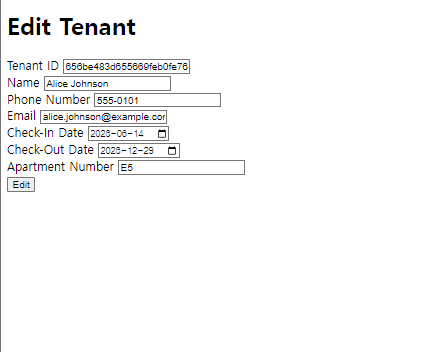

# CMPSC487-Project-3
## CMPSC487 Project 3 Web Interface for Maintenance and User Management system.

_Code was built on Pycharm IDE for Python programming_

## Getting Started

**Python Version: 3.11**

### 1. Clone the Repository
First, navigate to the directory where you want to store the project in the terminal. Then, clone the project repository:

```
git clone https://github.com/jinyoonok2/CMPSC487-Project-3.git
cd CMPSC487-Project-3
```

or you can use github Desktop to alternate this process.

### 2. Install Dependencies
Make sure you have `pip` (Python package installer) ready. Now, install the necessary packages:

```
pip install -r requirements.txt
```

### 3. Running the Program
With all dependencies installed, navigate to the project directory (if you haven't already) and run:

```
python app.py
```

This will launch the program. and open the web browser. If the web browser did not open automatically,
please go to the link: [http://127.0.0.1:5000/](http://127.0.0.1:5000/) (local)

## Usage


the user will get to access login page first when run the app.py program.

user can use any credentials from tenants, staff, or managers collections. (the initial population of the documents are given in the 'collections' folder, you must use their email and password)

password is identical all across the users for convenience: **jinyoon12**


First we will check the 'tenants' functional requirement using one of the tenant accounts.
User can find their information on their home page.
By clicking Log Out, user can go back to the login screen by ending the session.
By clicking submit request, user can move to the page of writing request for the maintenance.


Tenant ID and Apartment Number will automatically derived from the database according to the information of the current user.
User have to manually input Problem Area, Description, and upload image if they please to do so.
By clicking submit, the request will be saved to the maintenance_requests collection.


Now we will checking with the 'staff' functional requirements using one of the staff accounts.
User can find their information on their home page.
By clicking Log Out, user can go back to the login screen by ending the session.
By clicking View Request, user can View the maintenance requests submitted by the tenants.


Maintenance View Page will show the list of requests,
User also can browse using categories: Apartment Number, Problem Area, Status, Start Date and End Date.
If not input anything, the page will browse everything in the database.
Exceptionally, the Start Date and End Date have default values. (Start Date: One year ago from the current Date. End Date: One day later from the current Date)

User also can complete the request by clicking "Complete" button. the button will turn grey and it will turn into completed status while the button is now deactivated.


Now it is time for the manager, we will also use the account from the managers collection.
User can view the lists of tenants derived from the database by clicking "View Tenants".


In the Tenants List, user can read the information of the tenants,
Create New tenant by clicking Create New Tenant button or edit existing tenant information by clicking Edit button in each panel.

Or delete the tenant by clicking delete button.


When click create new tenant, user must input the informamtion for the new tenant.
Tenant ID can use the Object ID generated by Mongo DB therefore it can be blank.



Meanwhile, clicking edit user will show the same page but fields filled with existing information to the corresponding user.
User can edit the infomration and click edit.
