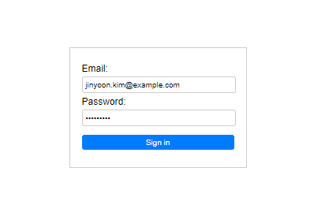
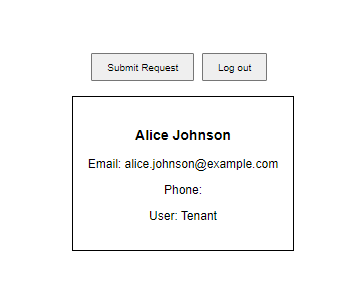
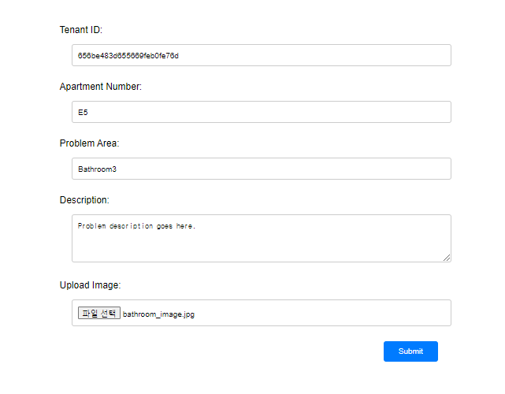
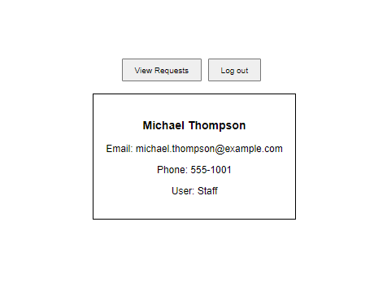
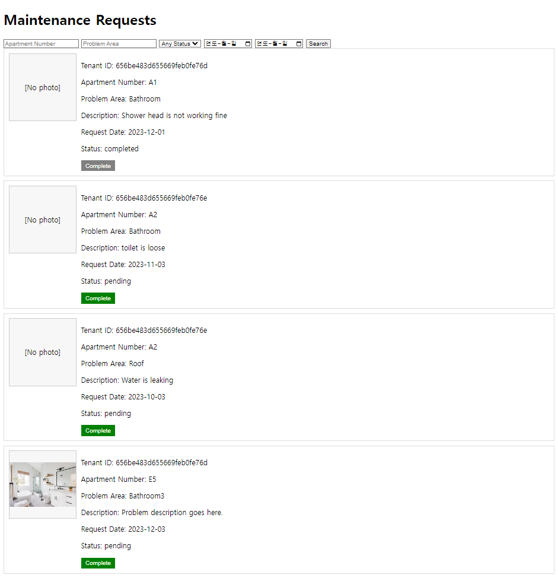
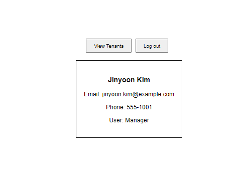
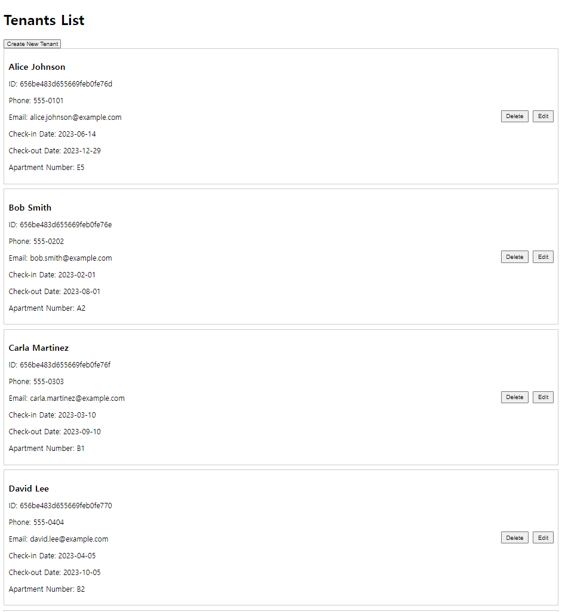
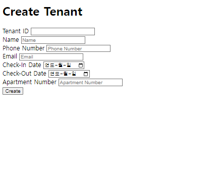

# CMPSC487-Project-3
## CMPSC487 Project 3 Web Interface for Maintenance and User Management system.

_Code was built on Pycharm IDE for Python programming_

## Getting Started

**Python Version: 3.11**

### 1. Clone the Repository
First, navigate to the directory where you want to store the project in the terminal. Then, clone the project repository:

```
git clone https://github.com/jinyoonok2/CMPSC487-Project-3.git
cd CMPSC487-Project-3
```

or you can use github Desktop to alternate this process.

### 2. Install Dependencies
Make sure you have `pip` (Python package installer) ready. Now, install the necessary packages:

```
pip install -r requirements.txt
```

### 3. Running the Program
With all dependencies installed, navigate to the project directory (if you haven't already) and run:

```
python app.py
```

This will launch the program. and open the web browser. If the web browser did not open automatically,
please go to the link: [http://127.0.0.1:5000/](http://127.0.0.1:5000/) (local)

## Usage



the homepage(index) enlists the item information from the MongoDB.
1) You can search the item with the search bar at the top
2) You can create new items and save their information up on the DB & save the image automatiaclly on your cloned github repo(since there is no server and it is local application, images will be saved on the repository of your machine)
3) You can edit or delete each item with the buttons at the rightside of each item panel.
4) As required, items are sorted by their name when they are displayed.

For the items uploaded on DB as initial seed data(such like camera and printer as you can see on the image), you can find them in itemsCollection.js file in this repository.



First we will check the search function of the program.
User can search the wanted item by putting its name on the search bar then clicking the search button.
Since the search function takes cares of case sensitive and blank space, user do not need to worry about the capitalized letter or blank space.
(ex: smart phone also works for Smartphone)
(ex: smart will work for both Smartphone and Smartwatch)



"smart phone" search successfully found Smartphone item



Now it is time to check create function.
when user click create button, it will lead the user to item_edit page where user can input name, description and upload image for the new item. (I apologize for the language is changed on my web browser, but if you run it on your program, it will properly display the choose file button for the image upload section)

If user click cancel button here, the information will not be saved and the user will be sent back to index page.

Note:
When new item is added, program deletes the existing image if the preliminary image has the same name with the new uploaded image and replace it with the new image. - this is done to free the image name allocation.



If user finish input then save, the new item will be saved successfully like the above picture.



Now it is time to check edit.
In fact, edit function uses the same page with create function.
However, edit page had already filled in the blank of name and description with the existing information of the item.
User can change the existing information by inputting new name or description or uploading new image.
The section where user did not make any change will remain the same.

Note:
When new image for the item is uploaded, program deletes the existing image if the preliminary image has the same name with the new uploaded image and replace it with the new image. - this is done to free the image name allocation.



As we can see, the "new item 1" we added now have the new name, new description, and new image we gave in the edit.



Now I clicked the delete button, and the new item we added are now gone.
Note:
When item is deleted, program also delete the image of the item when there is not other item that refer to that image. - This is done as the garbage collector of the images of the deleted items.

Thank you for reading.
